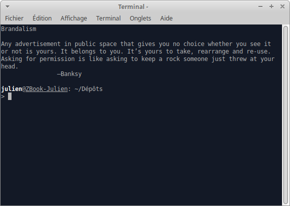

<p align="center"></p>

# Banksy cookie file

A collection of Banksy quotes, to use with `fortune`.

- Clone this repo and run `fortune /path/to/this/repo | fold -s` to get a fortune.
- For a systemwide installation, `cp /path/to/this/repo/Banksy{,.dat}  /usr/share/games/fortunes/` and run `fortune Banksy | fold -s` from anywhere

Some command line variants :

- `fortune` to get a random fortune from a random cookie file
- `fortune Banksy | fold -s` to get a Banksy fortune and break long lines on spaces
- `fortune Banksy -s -n 240` to get a Banksy fortune that is at most 240 characters long
- `fortune Banksy -s | sed 's/—Banksy//' | cowsay` to get a bovine advice (also works with ponies and cats)

```
 _______________________________________
/ Become good at cheating and you never \
\ need to become good at anything else. /
 ---------------------------------------
        \   ^__^
         \  (oo)\_______
            (__)\       )\/\
                ||----w |
                ||     ||

```

To run `fortune` in new interactive Bash, add this to your `${HOME}/.bashrc` :

```
if [ -n "${PS1}" ]
then
	fortune Banksy
fi
```

<p align="center"></p>

To add new quotes (or correct old ones) :

- Update `Banksy` file. Consecutive quotes must be separated by a line containing a single `%`
- Run `strfile -c% ./Banksy Banksy.dat` to index the quotes and produce the `.dat` file
- Issue a pull request on `Banksy` to help me keep this cookie file up to date !
